# DOKUMENTASI DESAIN SISTEM — KOPKAR RSI JEMURSARI

> **Proyek:** Point of Sales & Koperasi Karyawan

---

# 1. USE CASE DIAGRAM

### 1.1 Kasir

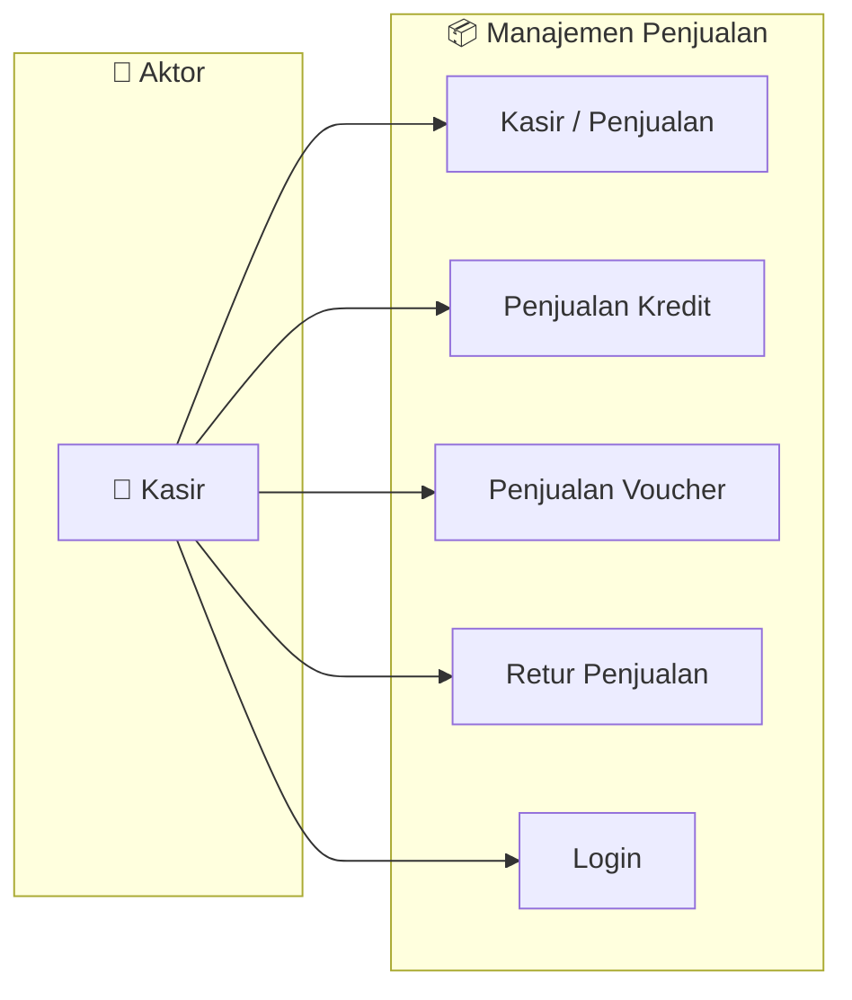

### 1.2 Gudang

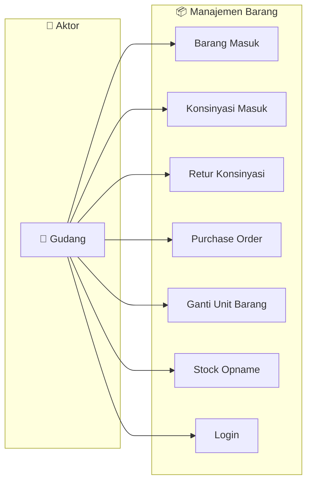

### 1.3 Keuangan

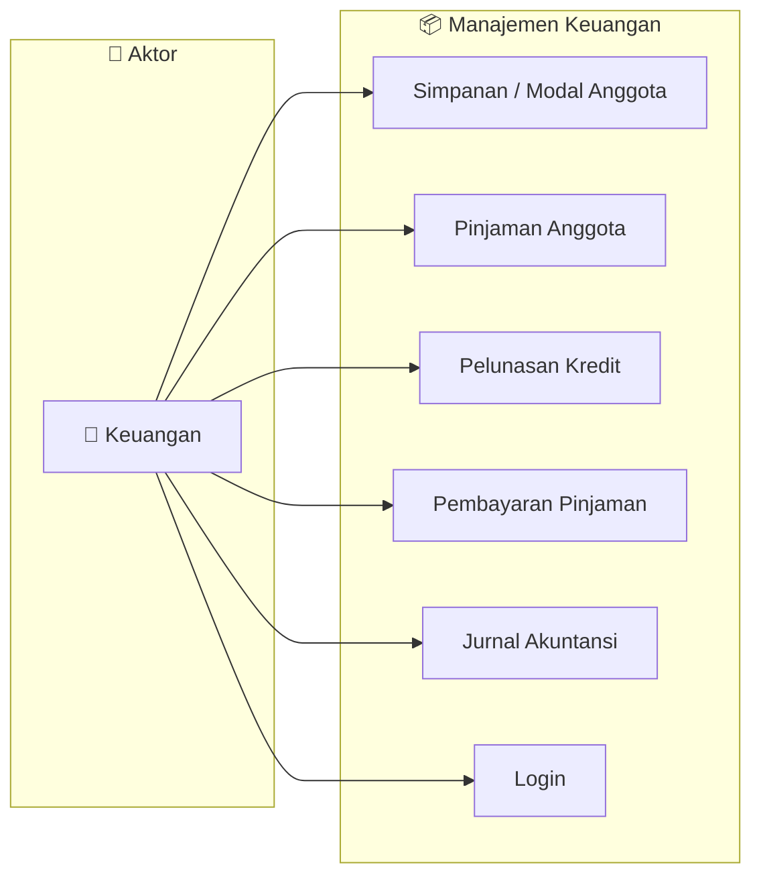

### 1.4 Admin

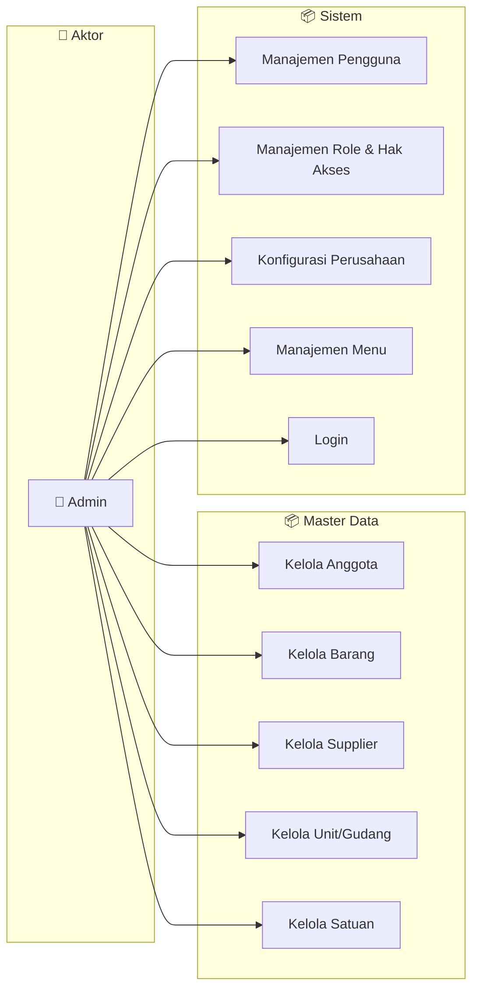

### 1.5 Pimpinan

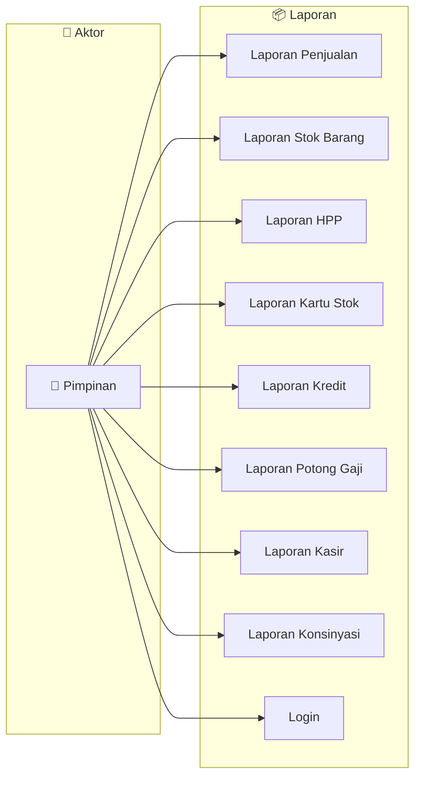

## 1.2 Aktor Sistem

| Aktor              | Deskripsi                                                                |
| ------------------ | ------------------------------------------------------------------------ |
| **Kasir**    | Melayani transaksi penjualan tunai, kredit, dan voucher kepada anggota   |
| **Gudang**   | Mengelola barang masuk, konsinyasi, PO, retur, dan stock opname          |
| **Keuangan** | Mengelola simpanan, pinjaman, pelunasan, dan jurnal akuntansi            |
| **Admin**    | Mengelola master data (anggota, barang, supplier) dan konfigurasi sistem |
| **Pimpinan** | Melihat seluruh laporan dan monitoring                                   |

## 1.3 Hak Akses (Role-Based Access Control)

Sistem menggunakan kontrol akses berbasis role dengan 5 permission per menu:

| Permission     | Kode          | Keterangan              |
| -------------- | ------------- | ----------------------- |
| Read           | `r`         | Melihat data (list)     |
| Create         | `c`         | Menambah data baru      |
| Update         | `u`         | Mengedit data           |
| Print          | `p`         | Mencetak laporan        |
| Delete         | `d`         | Menghapus data          |
| Approve        | `approve`   | Menyetujui transaksi    |
| Cancel Approve | `c_approve` | Membatalkan persetujuan |

---

# 2. SEQUENCE DIAGRAM

## 2.1 Sequence: Login

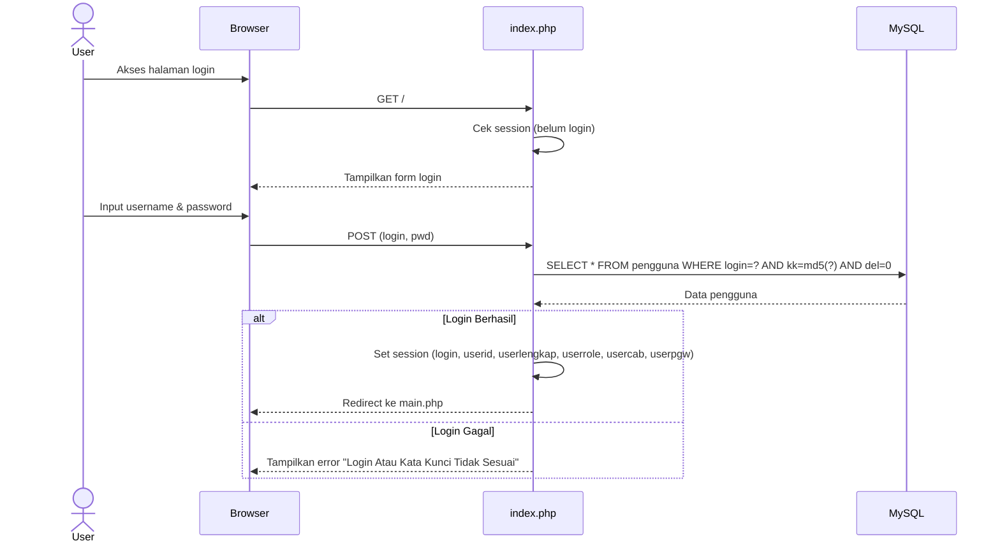

## 2.2 Sequence: Penjualan Kasir (CRUD via Framework)

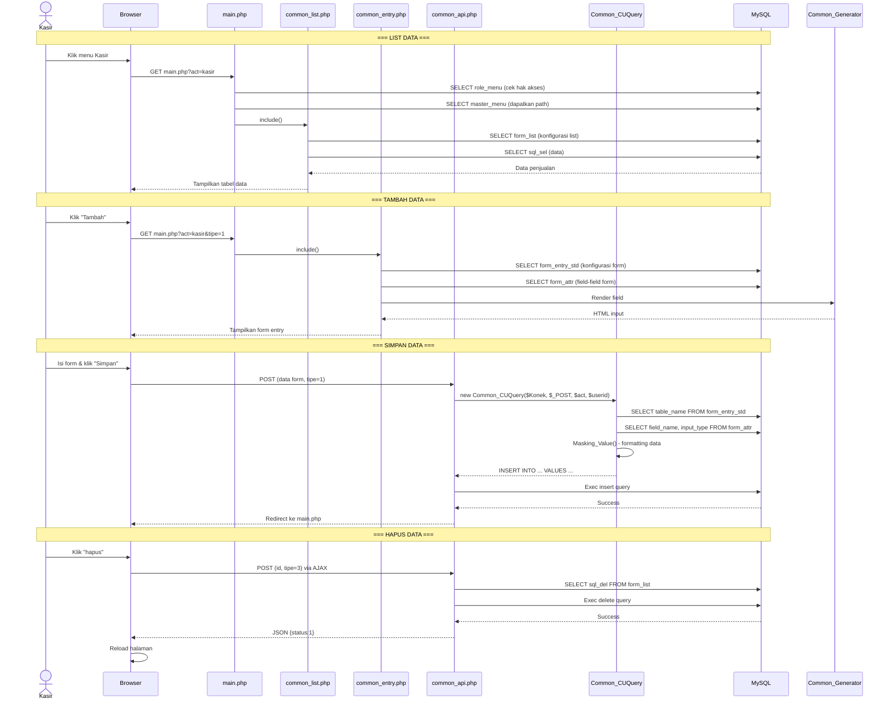

## 2.3 Sequence: Konsinyasi Masuk (KOSY)

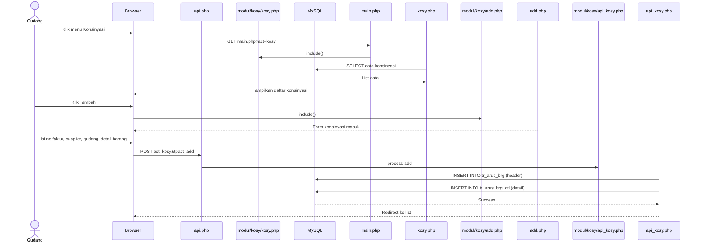

## 2.4 Sequence: Pinjaman Anggota

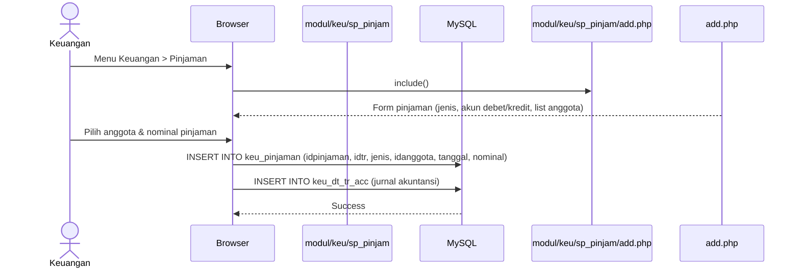

## 2.5 Sequence: Stock Opname / Restock (skrip_restock.php)

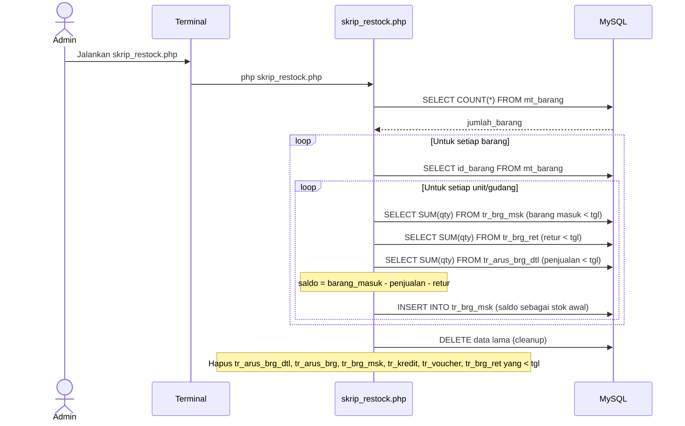

---

# 3. DOMAIN MODEL & CLASS DIAGRAM

## 3.1 Domain Model (Entity Relationship)

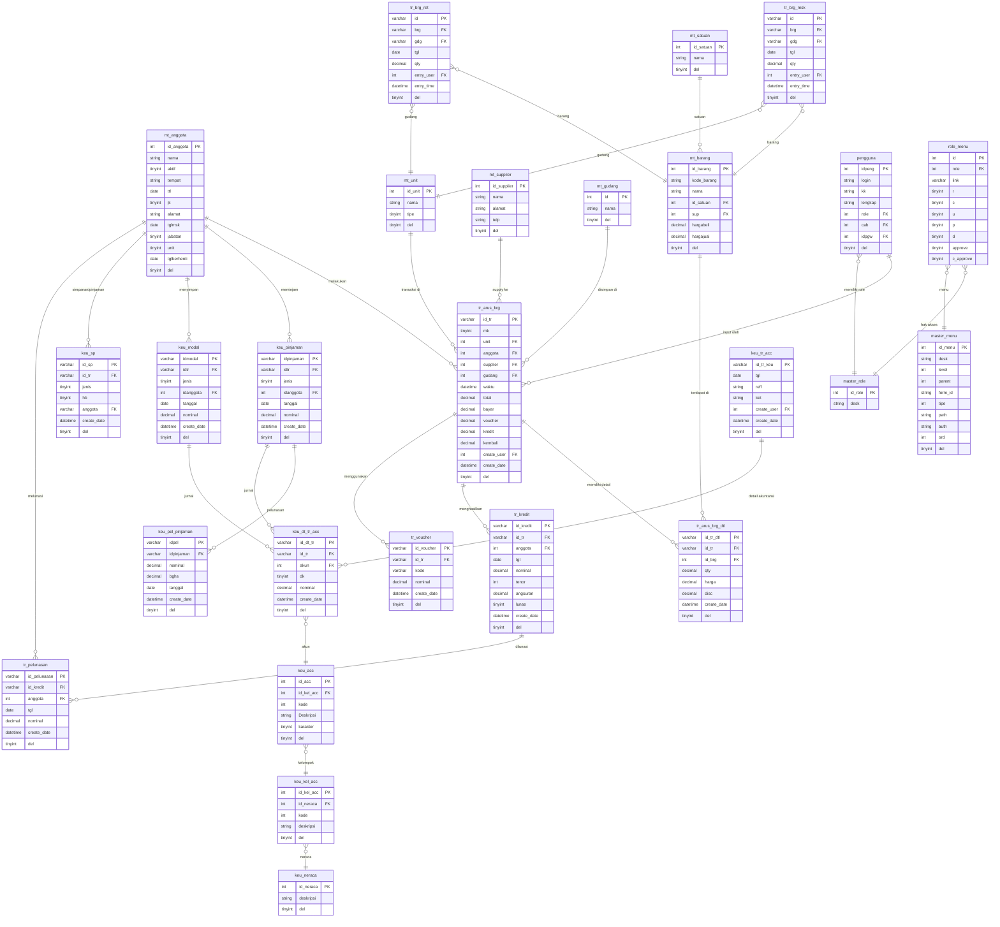

## 3.2 Class Diagram — Framework CRUD

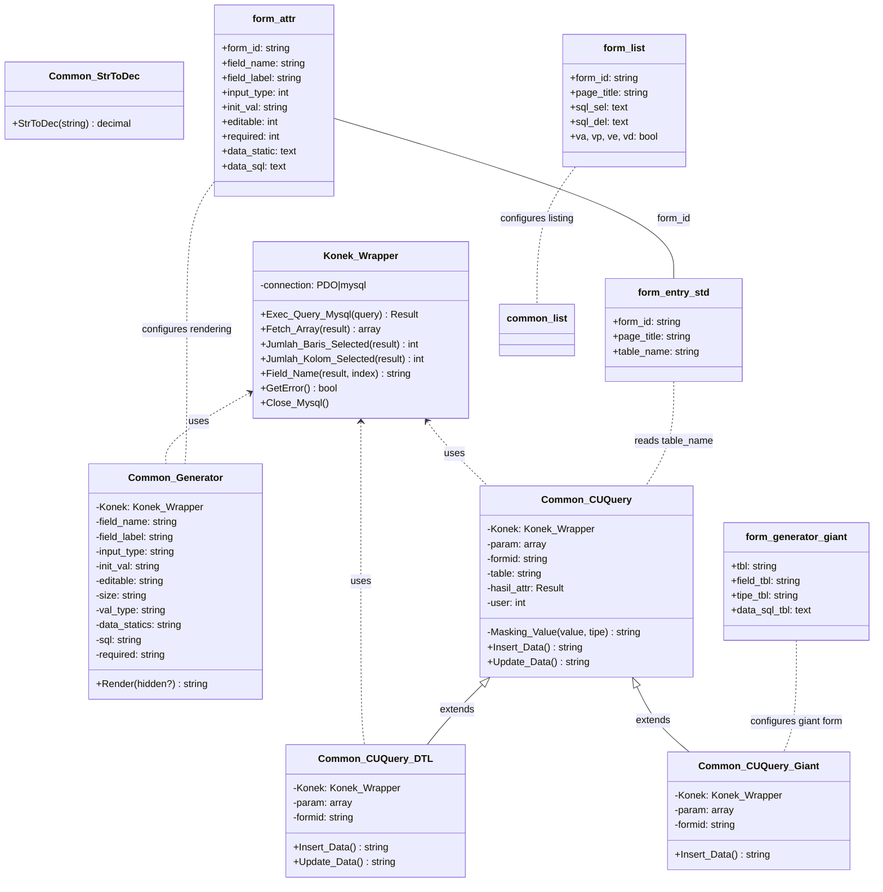

## 3.3 Class Diagram — Modul Bisnis

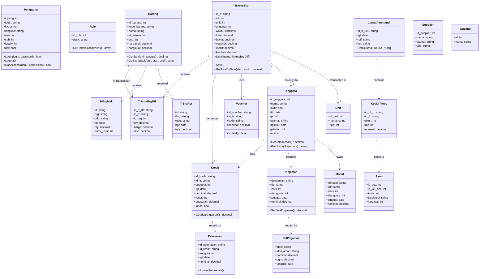

## 3.4 Arsitektur Sistem

```mermaid
flowchart TB
    subgraph "Presentation Layer"
        index[index.php - Login]
        main[main.php - Router Utama]
        header[header.php - Navigasi]
        footer[footer.php]
        home[home.php - Dashboard]
    end
  
    subgraph "Business Logic Layer"
        direction TB
        common_list[common_list.php - List Generator]
        common_entry[common_entry.php - Form Generator]
        common_api[common_api.php - API CRUD]
        common_cuquery[Common_CUQuery - Query Builder]
        common_generator[Common_Generator - Input Renderer]
        common_generator_dtl[Common_Generator_DTL - Detail Renderer]
    end
  
    subgraph "Modules"
        kasir[kasir/ - Penjualan]
        kosy[kosy/ - Konsinyasi]
        retur[retur/ - Retur]
        brg_msk[brg_msk/ - Barang Masuk]
        po[po/ - Purchase Order]
        keu[keu/ - Keuangan]
        laporan[laporan/ - Reports]
        master[master/ - Master Data]
        pelunasan[pelunasan/ - Pelunasan]
        stock_opt[stock_opt/ - Stok Opname]
        voucher[voucher/ - Voucher]
        sistem[sistem/ - System Config]
    end
  
    subgraph "Data Access Layer"
        connect[include/connect.php]
        class_mysql[class_Mysql_connect.php]
        class_pdo[class_PDO_connect.php]
    end
  
    subgraph "Database"
        db[(MySQL kopkar_rsi<br/>39 Tabel)]
    end
  
    main --> common_list
    main --> common_entry
    main --> home
    main --> kasir & kosy & retur & brg_msk & po & keu & laporan & master & pelunasan & stock_opt & voucher & sistem
  
    common_entry --> common_generator
    common_entry --> common_generator_dtl
    common_api --> common_cuquery
  
    common_list --> connect
    common_entry --> connect
    common_api --> connect
    modules --> connect
  
    connect --> class_mysql
    connect --> class_pdo
    class_mysql --> db
    class_pdo --> db
```

## 3.5 Deskripsi Tabel Database (39 Tabel)

### Tabel Konfigurasi Form (Framework Dinamis)

| Tabel                       | Fungsi                                                             |
| --------------------------- | ------------------------------------------------------------------ |
| `form_attr`               | Atribut field form entry (nama field, tipe input, validasi, label) |
| `form_attr_dtl`           | Atribut field untuk form detail                                    |
| `form_entry_std`          | Konfigurasi form entry standar (judul, nama tabel)                 |
| `form_entry_std_dtl`      | Konfigurasi form entry detail                                      |
| `form_generator_giant`    | Konfigurasi giant form (multi-tabel)                               |
| `form_generator_id_giant` | Konfigurasi ID generator giant form                                |
| `form_list`               | Konfigurasi halaman list (SQL select, SQL delete, hak akses)       |
| `tipe_input`              | Master tipe input (text, date, combo, checkbox, dll)               |

### Master Data

| Tabel           | Fungsi                            |
| --------------- | --------------------------------- |
| `mt_anggota`  | Data anggota koperasi             |
| `mt_barang`   | Data barang/jasa yang dijual      |
| `mt_gudang`   | Data gudang penyimpanan           |
| `mt_satuan`   | Data satuan barang (pcs, kg, dll) |
| `mt_supplier` | Data supplier/pemasok             |
| `mt_unit`     | Data unit/cabang retail           |

### Pengguna & Akses

| Tabel                 | Fungsi                                              |
| --------------------- | --------------------------------------------------- |
| `pengguna`          | Data pengguna sistem                                |
| `master_role`       | Master role pengguna                                |
| `role_menu`         | Mapping hak akses role ke menu (r,c,u,p,d, approve) |
| `master_menu`       | Daftar menu navigasi                                |
| `sys_comp`          | Konfigurasi sistem                                  |
| `sys_role`          | Role sistem (backup)                                |
| `sys_user`          | User sistem (backup)                                |
| `master_perusahaan` | Data perusahaan/cabang                              |

### Transaksi

| Tabel               | Fungsi                                |
| ------------------- | ------------------------------------- |
| `tr_arus_brg`     | Header transaksi penjualan/konsinyasi |
| `tr_arus_brg_dtl` | Detail item transaksi                 |
| `tr_brg_msk`      | Barang masuk / stok awal              |
| `tr_brg_ret`      | Retur barang                          |
| `tr_kredit`       | Transaksi kredit anggota              |
| `tr_pelunasan`    | Pelunasan kredit                      |
| `tr_voucher`      | Voucher penjualan                     |

### Keuangan/Akuntansi

| Tabel                | Fungsi                                         |
| -------------------- | ---------------------------------------------- |
| `keu_neraca`       | Klasifikasi neraca (aset, liabilitas, ekuitas) |
| `keu_kel_acc`      | Kelompok akun                                  |
| `keu_acc`          | Chart of account (daftar akun)                 |
| `keu_tr_acc`       | Header transaksi akuntansi/jurnal              |
| `keu_dt_tr_acc`    | Detail jurnal (debet/kredit)                   |
| `keu_pinjaman`     | Pinjaman anggota                               |
| `keu_pel_pinjaman` | Pelunasan pinjaman                             |
| `keu_modal`        | Modal/simpanan anggota                         |
| `keu_sp`           | Simpanan/pinjaman (SP)                         |
| `keu_shu_awal`     | Saldo SHU awal                                 |

---

## 3.6 Alur Data (Data Flow)

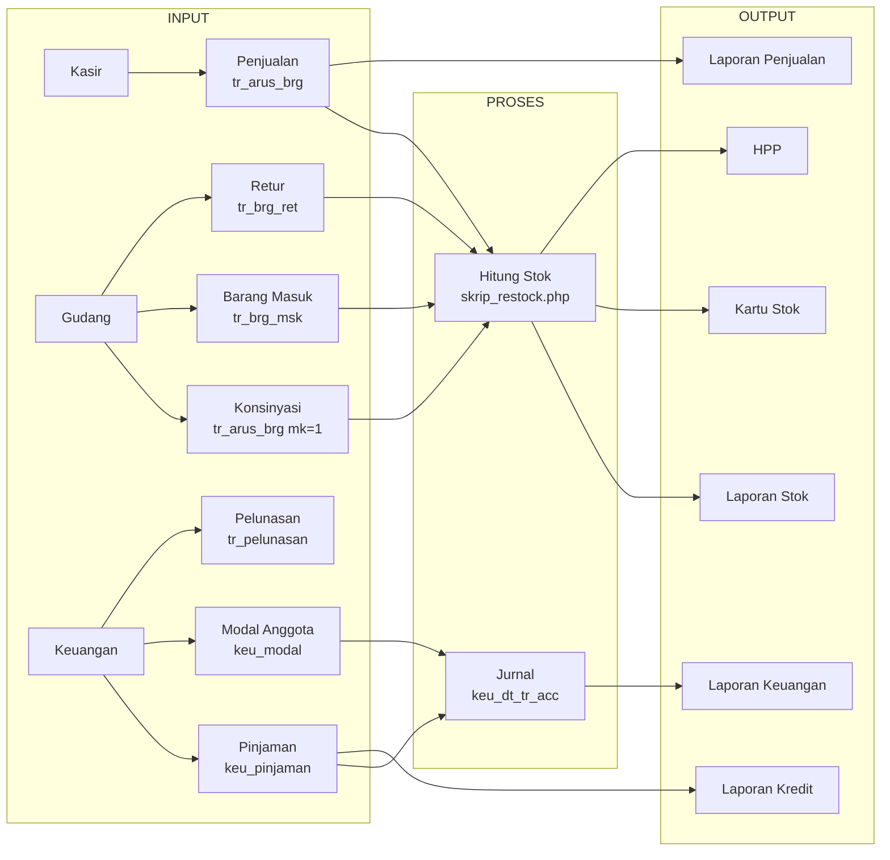

---

> **Dokumentasi ini dibuat oleh Giant Rachman Junaedi untuk menggambarkan arsitektur lengkap** **Sistem: KOPKAR RSI JEMURSARI — Point of Sales & Manajemen Koperasi Karyawan** dari sisi bisnis (use case), alur interaksi (sequence), struktur data (domain model/ERD), organisasi kode (class diagram), hingga dependensi antar modul.
